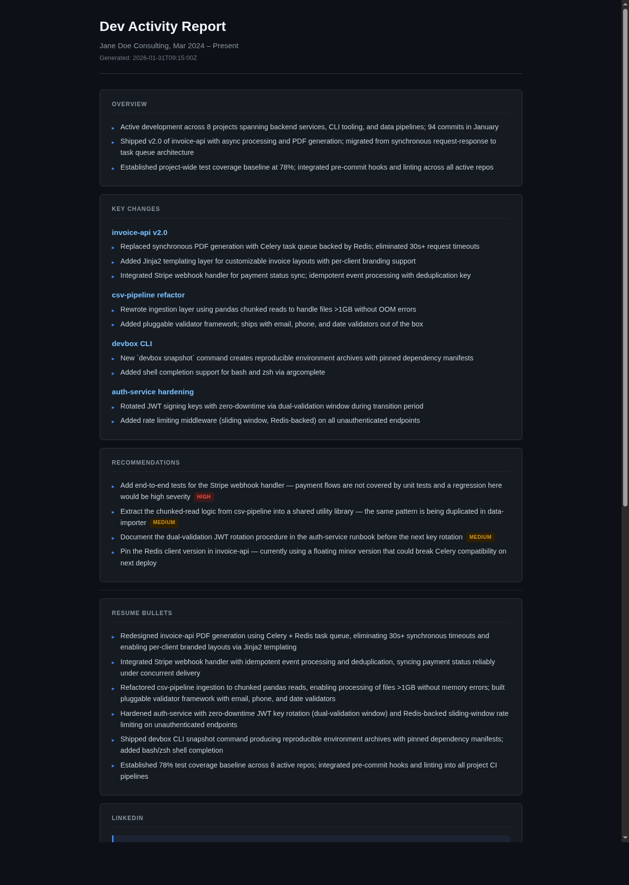
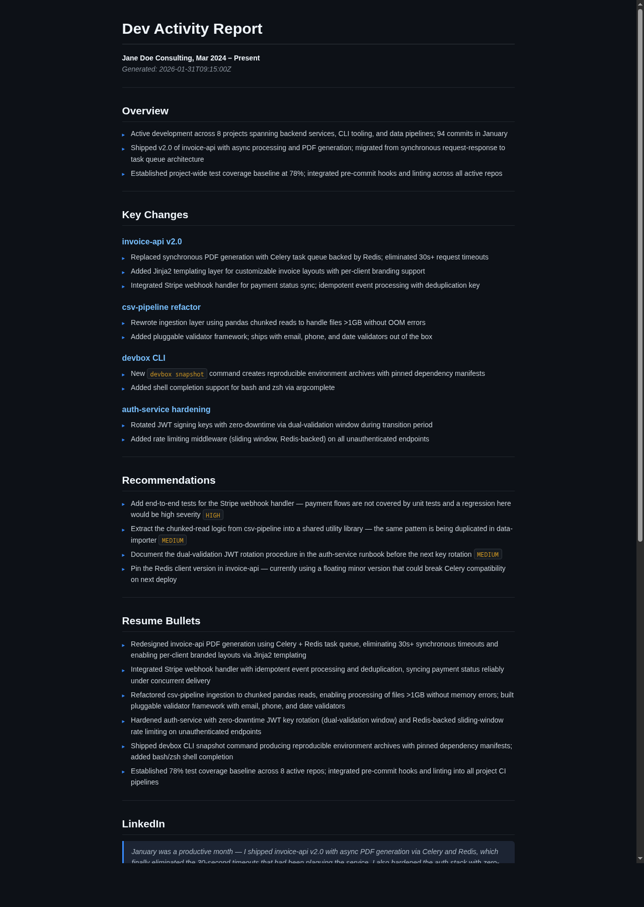

# dev-activity-report

A Claude Code skill that scans your local development environment — git repos, project directories, Claude session history, Codex session history — and generates professional activity summaries ready to paste into a resume, LinkedIn profile, or hiring manager email.

**It turns this:**
```
~/projects/
  my-api-service/    (git: 47 commits, Feb 2026)
  my-cli-tool/
  my-web-app/
  ...
~/.codex/sessions/
  50 session rollout files across Jan-Feb 2026
```

**Into this:**

> *Designed and codified a human-Claude-Codex orchestration system with formal task readiness gates, risk-tiered routing, per-task-type delegation metrics, and a self-tightening spec feedback loop triggered when rolling success rates fall below 70%*

---

## What It Does

`/dev-activity-report` now runs a four-step, token-thrifty pipeline:

1. **Phase 1 — Data gathering** (`phase1_runner.py` via Bash subagent, `${PHASE1_MODEL}`): scans the configured paths, computes content-based fingerprints (git-tracked files only), and emits a **compact JSON payload** (abbreviated keys documented in `docs/PAYLOAD_REFERENCE.md`). Cached runs short-circuit by re-emitting the previous payload.
2. **Phase 1.5 — Draft synthesis** (`phase1_5_draft.py`, `${PHASE15_MODEL}`): cheap model creates a rough bullet draft from the Phase 1 JSON. Falls back to a deterministic heuristic if no API key.
3. **Phase 2 — Structured Analysis** (`${PHASE2_MODEL}`): single-shot prompt that ingests the compact JSON + draft and outputs **JSON only** (no Markdown). No raw git logs are ever loaded.
4. **Phase 2.5 — Render** (script): `scripts/render_report.py` consumes the Phase 2 JSON and renders `md`/`html` based on `REPORT_OUTPUT_FORMATS`.
5. **Phase 3 — Cache writes** (`${PHASE3_MODEL}`): writes per-project `.dev-report-cache.md` files using the new content-hash fingerprints to keep future scans warm.

**Result:** A timestamped JSON report at `~/dev-activity-report-YYYYMMDDTHHMMSSZ.json` plus rendered outputs (`.md`, `.html`) based on `REPORT_OUTPUT_FORMATS`. Token/build logs are written under `REPORT_OUTPUT_DIR` by default. Consecutive runs get unique filenames and won’t overwrite each other.

---

## Sample Output

Example outputs generated from [`references/examples/example-report.json`](skills/dev-activity-report-skill/references/examples/example-report.json) using fictional data. Your actual report is generated from your git history, session logs, and project structure.

### HTML Report



### Markdown Report



See [`references/examples/example-report.md`](skills/dev-activity-report-skill/references/examples/example-report.md) and [`references/examples/example-report.html`](skills/dev-activity-report-skill/references/examples/example-report.html) for the full rendered files.

---

## Token Cost

Real measurements from a ~55-project environment (21 `.not-my-work`, 9 `.skip-for-now`, ~12 cached, 3 stale):

| Run type | Phase 1 tokens | Phase 1 cost | Phase 1 time | Tool uses | Total cost |
|---|---|---|---|---|---|
| Cold scan, no caches, no skips | ~18,300 | ~$0.024 | ~43s | 10 | **~$0.040** |
| Warm scan, 12 hits + `.skip-for-now` | **7,819** | **~$0.010** | **8.7s** | **1** | **~$0.031** |
| Fully warm, all skipped/cached | **~8,200** | **~$0.006** | **~7s** | **1** | **~$0.031** |
| All-Sonnet, no delegation (original) | ~25,000 | ~$0.075 | ~71s | ~15 | **~$0.113** |

**~65% total cost savings** from delegating off Sonnet. The warm Phase 1 is effectively free at Haiku rates — Phase 2 Sonnet synthesis (~$0.025) is the irreducible cost floor regardless of caching.

Token logging is now automated: Phase 1.5 and Phase 2 append JSON lines to `token_economics.log` and summary lines to `build.log` via `scripts/token_logger.py` (defaults to `REPORT_OUTPUT_DIR`, override with `TOKEN_LOG_PATH` / `BUILD_LOG_PATH`).

The `.skip-for-now` marker had a meaningful impact on its own: dropping 9 directories reduced Phase 1 from 18,304 tokens (~$0.024) to 8,233 (~$0.010) — a 55% reduction in data-gathering cost, independent of caching.

The new Phase 1 fingerprint cache takes things further: once `phase1_runner.py` has built a JSON payload, reruns with the same fingerprint simply reprint that payload and never re-run the Haiku scan, so the marginal cost becomes Phase 2 only.

> Full benchmarks, scaling tables, and real token counts in `references/token-economics.md`.

---

## Key Features

### Ownership classification
Three marker files classify project ownership without any central registry:

| File | Behavior |
|---|---|
| `.not-my-work` | Skip entirely — upstream clone, no original work |
| `.skip-for-now` | Skip entirely — parked, incomplete, or not yet worth reporting |
| `.forked-work` | Include under "Forked & Modified" with your contribution notes |
| `.forked-work-modified` | Auto-generate `.forked-work` from git archaeology, then promote |

The `.forked-work-modified` pattern is especially useful: drop an empty file in a forked repo, and the next scan uses `git log`, `git diff`, and file modification times to infer what you changed — writing the summary without you having to type it.

### Per-project caching
Each scanned project gets a `.dev-report-cache.md` with a fingerprint header:
```markdown
<!-- fingerprint: <git-hash-or-mtime> -->
<!-- cached: 2026-02-13 -->

## project-name
**Stack**: ...
**Summary**: ...
```

Fingerprints are now **content hashes of git-tracked files** (non-git directories hash only allowed extensions from `ALLOWED_FILE_EXTS`), eliminating false positives from mtimes or cache file writes. When the fingerprint matches, the cached analysis is used verbatim.

### Phase 1 fingerprint cache
`phase1_runner.py` also builds a global fingerprint across ownership markers, project directories, extras, Claude data, Codex sessions, and the insights log. The fingerprint and the structured JSON payload are stored in `.phase1-cache.json`; if a rerun finds no changes it simply reprints that JSON (Haiku never re-traverses the tree). The upshot: warm runs emit exactly one JSON object and trimming Phase 1 output costs almost nothing.

### Compact payload + cheap draft
Phase 1 emits abbreviated JSON keys (documented in `skills/dev-activity-report-skill/references/PAYLOAD_REFERENCE.md`) with only the essentials: commit counts, shortstats, changed files, and derived themes. Phase 1.5 uses a low-cost model to turn that JSON into a rough draft, and Phase 2 emits structured JSON — minimizing Sonnet tokens.

### Codex session analytics
Scans `~/.codex/sessions/` to surface Codex usage patterns — sessions by month, active project directories, installed skills, configured model — and includes them in the report and cache.

### Configurable via `.env`
All user-specific values (paths, identity, models) live in a `.env` file that's gitignored. The repo ships `references/examples/.env.example` — copy and fill in once, never touch again.

---

## Limitations & Roadmap

**Privacy note:** Phase 1 includes full absolute paths (project directories, Codex working directories) in the payload sent to the LLM in Phase 2. This is expected behavior — the paths are used to generate the report — but be aware that your local directory structure is part of the prompt. Set `INCLUDE_SOURCE_PAYLOAD=false` (the default) to omit the raw payload from the final JSON output file.

**Current limitations:**
- Single-machine only. Scans local filesystems; no native SSH orchestration yet.
- Interactive review is terminal-only (`--interactive`) and intentionally skipped in CI/non-TTY contexts.
- Multi-root scanning works for local paths, but remote mount latency can still dominate Phase 1 wall time.
- Non-git directory fingerprinting uses content hashes from allowed extensions; broad extension lists can increase scan time.

**Planned enhancements:**
- Multi-machine support via SSH or remote filesystem mounts
- Optional per-root concurrency for very large multi-root scans
- Richer interactive curation controls (bulk tags/reorder/export profiles)
- Deeper non-git heuristics for massive monorepos

---

## Installation

### Prerequisites

- [Claude Code](https://claude.ai/claude-code) CLI installed and authenticated
- Claude Code skills support enabled

### Install the skill

**One-command installer (recommended):**
```bash
python3 skills/dev-activity-report-skill/scripts/setup_env.py
```

Useful options:
- `--dry-run` to preview changes only
- `--interactive` to prompt for key `.env` values
- `--skip-setup` to sync files only
- `--configure-only` to update `.env` in the current repo copy without syncing

**Option A — Clone and install directly:**
```bash
git clone https://github.com/ngallodev/dev-activity-report-skill
cp -r dev-activity-report-skill ~/.claude/skills/dev-activity-report
```

**Option B — Manual:**
Copy `SKILL.md` and the `references/` directory to `~/.claude/skills/dev-activity-report/`.

### Configure

```bash
cp ~/.claude/skills/dev-activity-report/references/examples/.env.example \
   ~/.claude/skills/dev-activity-report/.env
```

Edit `.env` with your values (all tunables live here):

```bash
# Where your projects live
APPS_DIR=~/projects
# Optional multi-root scan list (comma/space separated). If set, takes precedence over APPS_DIR.
# APPS_DIRS=~/projects ~/work/client-apps

# Additional one-off directories to include (leave blank if none)
EXTRA_SCAN_DIRS=

# Where to write reports/logs (defaults to ~ if omitted)
REPORT_OUTPUT_DIR=~
REPORT_SANDBOX=workspace-write
REPORT_OUTPUT_FORMATS=md,html
INCLUDE_SOURCE_PAYLOAD=false

# Your name/company for the resume header
RESUME_HEADER="Your Name Consulting, Jan 2025 – Present"

# Optional: adjust hashing + model picks
ALLOWED_FILE_EXTS=".py,.ts,.js,.tsx,.cs,.csproj,.md,.txt,.json,.toml,.yaml,.yml,.sql,.html,.css,.sh"
PHASE1_MODEL=haiku
PHASE15_MODEL=haiku
PHASE2_MODEL=sonnet
PHASE3_MODEL=gpt-5.1-codex-mini
# Legacy prompt prefixes
PHASE1_PROMPT_PREFIX=
PHASE15_PROMPT_PREFIX=
PHASE2_PROMPT_PREFIX=
PHASE3_PROMPT_PREFIX=
# Preferred structured rule injection keys (safer for JSON phases)
PHASE15_RULES_EXTRA=
PHASE2_RULES_EXTRA=
# Optional: include quoted excerpts from Claude insights report in Phase 2 context
INCLUDE_CLAUDE_INSIGHTS_QUOTES=false
CLAUDE_INSIGHTS_QUOTES_MAX=8
CLAUDE_INSIGHTS_QUOTES_MAX_CHARS=2000
# Optional log paths (defaults to REPORT_OUTPUT_DIR if omitted)
# TOKEN_LOG_PATH=~/token_economics.log
# BUILD_LOG_PATH=~/build.log
# BENCHMARK_LOG_PATH=~/benchmarks.jsonl
# Optional time-window for git activity (also available as --since)
# REPORT_SINCE=2026-01-01
# Subscription auth (leave keys blank when true)
SUBSCRIPTION_MODE=true
```

The Codex/Claude paths and model selections can stay at their defaults unless your setup differs.

---

## Usage

### Run the report

```
/dev-activity-report
```

That's it. Claude reads your `.env`, delegates data gathering to Haiku, synthesizes a JSON report, renders `md`/`html`, delegates cache writes to Codex, and saves outputs to `~/dev-activity-report-YYYYMMDDTHHMMSSZ.{json,md,html}` based on `REPORT_OUTPUT_FORMATS`.

### Sandbox + workspace behavior

The runner passes `REPORT_SANDBOX` directly to `codex exec --sandbox`. Default is `workspace-write`. The Codex workspace is the current working directory where the run is invoked; paths outside that workspace may be blocked under `workspace-write`. If you choose a more permissive sandbox (for example `none`, if your Codex build supports it), you can scan and write outside the workspace. When any phase uses a non-Claude model and paths fall outside the workspace, the runner prints a warning to stderr.

### Run as a standalone script (no Claude Code session required)

Use `run_pipeline.py` to run the full pipeline directly without the `codex exec` overhead or needing an active Claude Code session:

```bash
# Background (default) — logs to ~/pipeline-run-<TS>.log
python3 skills/dev-activity-report-skill/scripts/run_pipeline.py

# Foreground — streams all phase output to terminal
python3 skills/dev-activity-report-skill/scripts/run_pipeline.py --foreground

# Scope git activity to a window and force fresh Phase 1
python3 skills/dev-activity-report-skill/scripts/run_pipeline.py --foreground --since "2026-01-01" --refresh

# Scan multiple project roots
python3 skills/dev-activity-report-skill/scripts/run_pipeline.py --foreground --root ~/projects --root ~/work/client-apps

# Optional local review/edit pass before render (skips automatically in CI/non-TTY)
python3 skills/dev-activity-report-skill/scripts/run_pipeline.py --foreground --interactive
```

This script:
- Runs `phase1_runner.py` as a subprocess (same logic, no overhead)
- Supports `--since`, `--refresh`, and repeatable `--root` arguments (also env fallbacks: `REPORT_SINCE`, `APPS_DIRS`)
- Calls `phase1_5_draft.py` for the Haiku draft; falls back to `claude --model haiku -p` if no `openai` SDK installed
- Calls `claude --model sonnet -p` directly for Phase 2 and expects **JSON only**
- Optionally opens an interactive JSON curation step (`--interactive`) between Phase 2 and rendering
- Renders outputs via `scripts/render_report.py` to `md`/`html` based on `REPORT_OUTPUT_FORMATS`
- Runs Phase 3 cache verification inline in Python
- Appends timing and token usage to `BENCHMARK_LOG_PATH` (default: `REPORT_OUTPUT_DIR/benchmarks.jsonl`)
- Sends a desktop notification on completion

**Requires**: `claude` CLI on `PATH` (authenticated). Does not require the `anthropic` or `openai` Python packages.

#### Benchmark results (2026-02-17, 12 runs)

All runs measured on this machine with `haiku` for Phases 1 and 1.5, `sonnet` for Phase 2:

| Metric | Value |
|---|---|
| Phase 1 (data gather) | **0.69–0.87s** |
| Phase 1.5 (Haiku draft via `claude -p`) | **7.3–9.0s** |
| Phase 2 (Sonnet JSON synthesis via `claude -p`) | **27–34s** |
| Phase 3 (cache verify, inline Python) | **<0.01s** |
| **Total wall time** | **37–43s** |

Token usage per run (Anthropic subscription; `cost_usd=0` in subscription mode):
- Phase 1.5: ~5,000–27,000 cache_creation tokens + ~17,000–22,000 cache_read tokens, ~173–289 output tokens
- Phase 2: ~5,700–24,000 cache_creation tokens + ~17,710 cache_read tokens, ~1,055–1,360 output tokens

The first run after a long idle period creates new prompt cache entries (higher `cache_creation` count, no `cache_read`). Subsequent runs within the cache TTL show high `cache_read` and minimal `cache_creation`.

#### Fingerprint ignore list

The fingerprinter (`phase1_runner.py` and the Claude CLI version) uses `.dev-report-fingerprint-ignore` (at the skill root) to exclude volatile files from content-hash computation. Without this, every pipeline run would invalidate the cache because runtime artifacts (logs, Claude session todos, debug files) change on each run.

Key excluded patterns:
- `*.log`, `build.log`, `references/examples/token_economics.log` — runtime logs
- `benchmarks.jsonl` — benchmark output (default in `REPORT_OUTPUT_DIR`)
- `todos/*`, `tasks/*`, `projects/*` — per-session Claude Code artifacts
- `debug/*`, `*.txt` — Claude Code debug files
- `ccusage-blocks.json`, `stats-cache.json` — billing/stats cache
- `.credentials.json` — auth tokens (also security-sensitive)

To add project-specific exclusions, edit `.dev-report-fingerprint-ignore` in the skill directory.

---

### Consolidate Reports

Use the consolidator to merge report outputs into a single aggregate artifact set.

By default (`--source-format auto`), it prefers JSON reports when present and emits:
- aggregate JSON
- aggregate Markdown
- aggregate HTML

Use `--source-format md` only when you explicitly want legacy Markdown-source parsing.

```bash
python3 skills/dev-activity-report-skill/scripts/consolidate_reports.py \
  --test-report-root <path/to/dev-activity-report-skill> \
  --report-root ~ \
  --output ~/dev-activity-report-aggregate.md
```

Templated values are provided via environment variables:

- `DAR_TEST_REPORT_ROOT` (default: `<path/to/dev-activity-report-skill>`)
- `DAR_REPORT_ROOT` (default: `~`)
- `DAR_TEST_REPORT_GLOB` (default: `codex-test-report-*.md`)
- `DAR_REPORT_GLOB` (default: `dev-activity-report-*.md`)
- `DAR_TEST_REPORT_JSON_GLOB` (default: `codex-test-report-*.json`)
- `DAR_REPORT_JSON_GLOB` (default: `dev-activity-report-*.json`)
- `DAR_SOURCE_FORMAT` (default: `auto`; one of `auto|json|md`)
- `DAR_AGGREGATE_FORMATS` (default: `json,md,html`)
- `DAR_AGGREGATE_OUTPUT` (default: `~/dev-activity-report-aggregate.md`)
- `DAR_AGGREGATE_TITLE` (default: `Dev Activity Report — Aggregate`)

### Suggested global config tip

Consider adding this to your global memory/config file so your agent stays consistent:

```
Use detailed, descriptive commit messages and PR descriptions. This improves traceability and makes the tooling more useful and your life easier.
```

### First run: mark your forks

Before the first run, mark upstream clones you haven't modified so they don't appear as original work:

```bash
# Skip entirely — upstream clone, no original work
touch /path/to/upstream-clone/.not-my-work

# Skip for now — parked, incomplete, or not worth reporting yet
touch /path/to/wip-project/.skip-for-now

# Include as fork — write your contribution notes in the file
echo "- Added custom logging middleware" > /path/to/fork/.forked-work

# Auto-generate contribution notes from git history
touch /path/to/fork/.forked-work-modified
```

For `.forked-work-modified`, the next scan will inspect git log, diffs, and file timestamps to write the `.forked-work` file for you, then delete the trigger. This is a best-effort heuristic — review the generated `.forked-work` file before running the report to confirm the attribution is accurate.

### Warm scans

Once projects are cached, re-running the skill only re-analyzes projects with new commits or modified files. Typical warm-scan cost is ~$0.031.

### Thorough refresh (full re-evaluation prep)

If you want a "start fresh" pass across all configured roots, use:

```bash
# Dry-run (preview actions)
python3 skills/dev-activity-report-skill/scripts/thorough_refresh.py

# Apply refresh:
# - clear skill + project cache files
# - promote .forked-work -> .forked-work-modified when missing
# - clear .not-my-work on forked repos so they can be re-evaluated
python3 skills/dev-activity-report-skill/scripts/thorough_refresh.py --confirm

# Most aggressive reset (also clear skips and all not-my-work markers)
python3 skills/dev-activity-report-skill/scripts/thorough_refresh.py --confirm --clear-skip --clear-not-my-work-all
```

---

## File Reference

```
dev-activity-report-skill/
├── SKILL.md                          # Core skill instructions
├── references/examples/.env.example  # Config template (copy to .env)
├── .gitignore                        # Ignores .env
├── scripts/render_report.py          # Render JSON to md/html
└── references/
    ├── token-economics.md            # Cost benchmarks and real test results
    ├── build-history.md              # Design chronicle — how this skill was built
    └── PAYLOAD_REFERENCE.md          # Compact key reference
```

Files written to your environment during use:
```
<APPS_DIR>/<project>/.dev-report-cache.md    # Per-project analysis cache
<APPS_DIR>/<project>/.not-my-work            # Ownership marker (you create)
<APPS_DIR>/<project>/.forked-work            # Fork contribution notes
~/.codex/.dev-report-cache.md               # Codex session analytics cache
~/dev-activity-report-YYYYMMDDTHHMMSSZ.json       # Structured JSON output (UTC datetime)
~/dev-activity-report-YYYYMMDDTHHMMSSZ.md         # Rendered Markdown (if enabled)
~/dev-activity-report-YYYYMMDDTHHMMSSZ.html       # Rendered HTML (if enabled)
```

---

## How It Was Built

This skill was designed and iterated entirely within Claude Code sessions. The `references/build-history.md` file chronicles the full build: 7 milestones from a freeform prompt to a three-phase cache-aware delegation-optimized system, including the discovery that `general-purpose` vs `Bash` subagent type caused a 100x difference in effective token cost.

Key design principles that emerged:

- **Description field as trigger gate** — The SKILL.md `description` is the sole mechanism preventing auto-triggering. Negative constraints matter as much as positive ones.
- **Marker files as lightweight metadata** — `touch .not-my-work` permanently classifies a project. No database, no config file, just a filesystem signal co-located with the code.
- **Auto-documentation via git archaeology** — `.forked-work-modified` demonstrates using AI to eliminate a class of tedious work, triggered by a filesystem event.
- **Agent type matters more than model** — `general-purpose` subagent loaded 618k cache-read tokens per run; `Bash` subagent uses ~5k. The right agent type was a 100x cost optimization.
- **Separate data gathering from synthesis** — Phase 1 collects facts (cheap model, no reasoning). Phase 2 synthesizes (expensive model, reasoning only). Never spend Sonnet tokens on I/O work.
